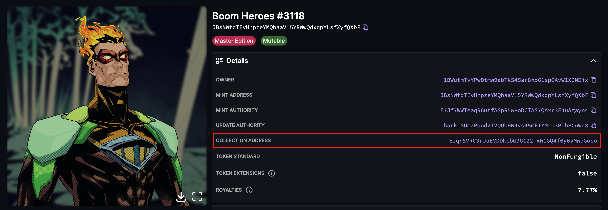

# Solana NFT Collections

The home of snapshots for the Legends of Solana. When you know you know.

This repository is a collection of snapshots for various NFT projects on the Solana blockchain. Each snapshot is a JSON file that contains the addresses of the NFTs and their owners. For your NFT project to be submitted to the repository be sure to generate a snapshot which follows the format from https://www.helius.dev/blog/nft-holder-snapshots.

## Project Hashlists

- AEP Life Form
- BOOGLE
- Boom Heroes - https://boom.army
- Bozo Collective - https://twitter.com/BozoCollective
- Brewed Bones - https://www.brewedbones.com
- Bullyz Crew - https://www.bullyzcrew.com
- Bullyz Loot Box - https://www.bullyzcrew.com
- Bullyz Shipz - https://www.bullyzcrew.com
- BVDCATs - https://bvdcat.io/
- Cets
- Chads
- Dawnbreakers - https://radiant.nexus/
- Deanslist
- Degen Dad
- Degen Royale - https://degenroyale.io/
- DTB Collection NFT - https://www.degentradingbears.xyz
- Dev Card - https://www.devnet.directory/
- doges_unleashed
- Famous Fox Federation - https://famousfoxes.com
- GIZMOS : Land - https://playgizmos.com/
- GnomieZ - https://gnomiez.fun
- GnomieZ: GEN2
- Grim Syndicate - https://grimsyndicate.com
- Lurkers of the Abyss - https://grimsyndicate.com
- GRINDERS NFTS
- SolKongz - https://www.solkongz.net
- Lifinity Flares - https://lifinity.io
- Mad Lads - https://madlads.com
- MixtApe - https://mixt-ape.com
- Solana Money Boy - https://www.solanamoneyboys.com
- Okay Bears - https://www.okaybears.com/
- Ordo Nemesis - https://ordonemesis.com/
- Pesky Penguins - https://pesky-penguins.com
- Photo Finish PFP Collection - https://photofinish.live
- S- Generation Zero Horse Ticket - https://photofinish.live
- Primus Gladiators
- raccs - raccs.io
- Radiants - https://radiant.nexus/
- Saga Monkes
- Secret Sphinx - https://secretsphinx.io/
- Sentries - https://sentries.io/
- Shremps - https://shrempin.com
- SMB Gen2 - https://solanamonkey.business/
- Solana Surfer
- Sollamas - https://sollamas.com
- species
- Squidz
- Tensorians - https://www.tensor.trade/
- True OG
- True OG
- The Roundies - https://theroundies.co
- THUG - https://www.thugbirdz.com/
- WOOFers - https://www.woofsolana.world
- Zilly Goat 7777 Series - https://www.zillionairegoatclub.com

## Structure of the Repository

The repository is structured as follows:

- The `NFTs/` directory contains folders for each NFT project. Each folder is named after the project it represents.
- Inside each project's folder, there are JSON files named in the format `{project_YYMMDD}.json`. These files are the snapshots for the project.

## Adding New Snapshots to the Collection

To add a new snapshot to the collection, follow these steps:

1. Fork this repository and run `npm install` inside the downloaded fork folder to install all dependencies
2. Snakecase the name of the project in your mind palace eg. `Legends of Solana` becomes `legends_of_solana`
3. Get the collection address:

4. Run `npm run snapshot {project_name} {collection_address}` to generate a snapshot - eg. `snapshot boom_heroes EJqr8VRC3rJaEVDDkcbG9G122ixW1GQ4f6y6vMwaGoco`
5. Open a PR with the new snapshot

## Example PR

A good example of a PR can be seen here with complete data formats for NFT projects:

[Example PR](https://github.com/Legends-of-Sol/Solana-NFT-collections/pull/3)

## Contributing

We welcome contributions from the community. If you have a new snapshot to add or an update to an existing one, please submit a PR. If you have any questions or need help, feel free to open an issue.